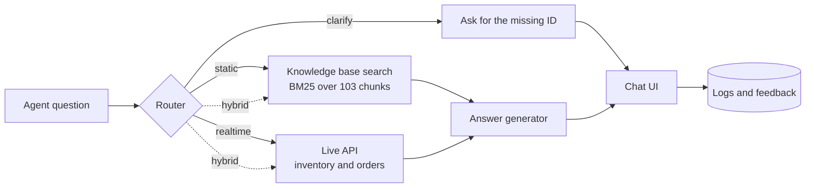

# ARAG: Dealer Support Assistant

**An agentic RAG assistant that answers dealer support questions from policy documents *and* live systems, with every answer cited and every decision measured.**

Dealer support agents answer the same policy questions repeatedly (warranty, returns, parts) while also checking live systems for stock and order status. ARAG routes each question to the right source, the knowledge base, a live API, or both, and returns an answer the agent can verify before replying.

> 📄 **Product Requirements Document:** [`docs/ARAG_Model_PRD.docx`](docs/ARAG_Model_PRD.docx): problem framing, metrics, decision log, content audit, rollout plan and results.

> 🚧 **Status:** local phase complete (keyword retrieval, rule-based routing, no LLM, zero cost). Cloud phase next: embeddings, LLM answers and LLM routing.

---

## Demo

<!-- Replace with your recording: e.g. docs/demo.gif -->


*Try: a policy question, a stock check, a hybrid question, a clarification follow-up, and the simulated API outage.*

---

## How it works



| Route | When | Example |
|---|---|---|
| 📚 **Static** | The answer is in the policy documents or catalogs | *How long is the standard warranty on a new vehicle?* |
| ⚡ **Real-time** | The answer changes during the day | *How many BRK-1020 calipers are in stock?* |
| 📚⚡ **Hybrid** | Needs both | *Is ELC-3030 in stock, and can the dealer return it once opened?* |
| ❓ **Clarify** | A live lookup is needed but the ID is missing | *Where is my order?* |

### Key features

- **Cited answers:** every knowledge base answer shows its sources, so agents can verify before replying.
- **Explainable routing:** every answer shows *why* it took its route.
- **Smart clarification:** *"Check stock for the front brake caliper"* gets *"BRK-1020 (left) or BRK-1021 (right)?"*, and a reply of *"BRK-1020"* or *"the left one"* is combined with the original question.
- **Graceful degradation:** if the live API is down or slow, the assistant says so clearly, and hybrid answers still return the knowledge base part.
- **Change-aware ingestion:** only new, edited or deleted documents are re-processed, so chunks never go stale.
- **Observability:** every interaction and 👍/👎 rating is logged.

---

## Results so far

Measured with a labeled test set of 40 questions (15 static, 10 real-time, 5 hybrid, 7 out-of-scope, 3 ambiguous) plus a **15-question held-out set** written after the routing rules were finished and never used to tune them.

| Metric | Target | Local baseline | |
|---|---|---|---|
| Retrieval relevance (doc hit@3) | ≥ 80% | **90%** (BM25) | ✅ |
| Routing accuracy, main test set | ≥ 90% | **100%** (rules) | ✅ |
| Routing accuracy, held-out set | ≥ 90% | **80%** (rules) | ❌ → LLM router |
| Entity extraction (part and order IDs) | — | **100%** | ✅ |
| Answer correctness, refusals | ≥ 85%, 100% | Measured in the cloud phase | ⏳ |

### What the numbers taught me

- **Keyword search is a strong baseline, but it can't handle paraphrases.** Both retrieval misses use different words from the documents ("car loan" vs. "financing", "send back" vs. "returned"). That is the gap hybrid search is meant to close.
- **A score threshold can't decide when to say "I don't know."** Out-of-scope questions scored as high as answerable ones: *"oil filter for the SUV Touring"* matches catalog words even though no such part exists. Refusal needs an LLM to check whether the passages actually answer the question.
- **Rules overfit.** The rule router scored 100% on the questions it was written against but **80% on new phrasings** like *"BRK-1001 qty at WH-EAST"*. I deliberately didn't patch the rules to pass, because that would hide the problem. The 20-point gap is the measured case for an LLM router.
- **Hands-on testing finds what metrics miss.** Using the UI revealed that a reply like "BRK-1020" lost its context after a clarifying question, which led to the follow-up resolution feature.

> **Limitation:** the test sets were written by me, the builder, so they may share my blind spots. The next step is validating with questions written by someone else.

---

## Design decisions

Full reasoning is in the PRD's **Key Decisions** and **Decision Evolution** sections. Highlights:

| Decision | Choice | Why |
|---|---|---|
| Chunking | Section-based for policies, **one chunk per catalog row** | Keeps each part's compatibility and price together; a part never mixes with its neighbor |
| Retrieval | BM25 now, **hybrid (BM25 + vectors, Reciprocal Rank Fusion)** next | Exact part IDs need keyword matching; paraphrases need semantic search |
| Routing | **Tiered**: regex for IDs, rules for clear cases, LLM for the rest, rules as fallback | IDs have fixed formats; rules are free and predictable; the LLM handles phrasing |
| Conflicting sources | **Show both and flag the conflict** | A content audit found contradictory return rules; agents need to know when policy is unclear |
| Architecture | Explicit router before a tool-calling agent | A routing decision can be tested and debugged, and its cost is predictable |
| Build order | **Local first, LLM last** | Every component is built, tested and measured for free before any cloud spend |

---

## Getting started

Runs in **GitHub Codespaces** (nothing to install on your machine) or locally with Python 3.11+.

```bash
# 1. Install dependencies
pip install -r requirements.txt

# 2. Chunk the knowledge base
python -m src.ingest

# 3. Start the mock API (terminal 1)
uvicorn mock_api.main:app --port 8000      # Swagger UI at /docs

# 4. Start the app (terminal 2)
streamlit run app.py                       # opens on port 8501
```

### Test and evaluate

```bash
pytest -q                    # 107 automated tests
python -m eval.run_eval      # retrieval and routing metrics, saved to eval/results/
```

### Useful tools

```bash
python -m src.inspect_chunks --id parts_catalog_brakes::BRK-1020   # look at a chunk
python -m src.retrieve "What is the restocking fee for returns?"   # test search
python -m src.router "Where is my order?"                          # test routing
python -m src.pipeline "Is ELC-3030 in stock?"                     # full answer in the terminal
```

---

## Project structure

```
arag-dealer-assistant/
├── app.py                  # Streamlit chat UI
├── knowledge_base/         # 17 synthetic policy and catalog documents
├── mock_api/               # FastAPI inventory and order systems + synthetic data
├── src/
│   ├── ingest.py           # chunking with change detection
│   ├── retrieve.py         # BM25 search, rank fusion, small-to-big context
│   ├── router.py           # route decision + ID extraction
│   ├── conversation.py     # clarification follow-ups
│   ├── api_client.py       # live API calls with timeouts and fallbacks
│   ├── generator.py        # answer formatting (stub now, LLM next)
│   └── pipeline.py         # end-to-end flow, logging, feedback
├── eval/                   # test sets, evaluation harness, results history
├── tests/                  # 107 automated tests
├── data/                   # generated chunks and manifest
└── docs/                   # PRD
```

---

## Roadmap

- [x] Mock inventory and order APIs with failure simulation
- [x] Ingestion with section and row-level chunking, plus change detection
- [x] BM25 retrieval and evaluation harness
- [x] Rule-based router with held-out evaluation
- [x] Pipeline, chat UI, logging, feedback, clarification follow-ups
- [ ] Cloud embeddings and hybrid search (target: fix both paraphrase misses)
- [ ] LLM answer generation with citations, refusals and conflict flags
- [ ] LLM router (target: ≥ 90% on the held-out set)
- [ ] Container deployment with a public demo link
- [ ] v2: conversational query rewriting, dealer self-service

---

## About this project

A personal portfolio project exploring RAG and LLM routing from both the **product** and the **engineering** side. It is modeled on a product I owned professionally, but this implementation is my own. All data is **synthetic**: no real company systems, customers or documents are used.

**Built with:** Python · FastAPI · rank-bm25 · Streamlit · pytest · GitHub Codespaces

**Author:** [Your Name](https://www.linkedin.com/in/your-profile)
