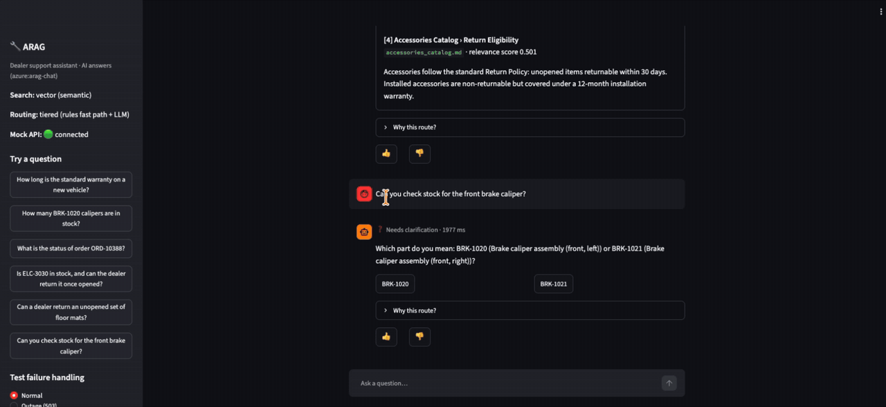
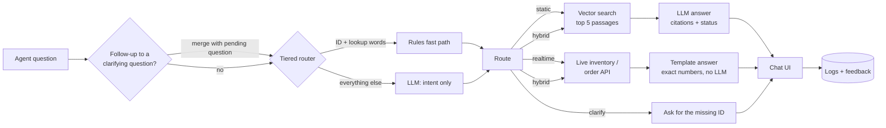

# ARAG: Dealer Support Assistant

**An agentic RAG assistant that answers dealer support questions from policy documents *and* live systems, with every answer cited, every routing decision explained, and every design choice measured.**

Dealer support agents answer the same policy questions repeatedly (warranty, returns, parts) while also checking live systems for stock and order status. ARAG routes each question to the right source (the knowledge base, a live API, or both) and returns an answer the agent can verify before replying to a dealer.

> 📄 **Product Requirements Document:** [`docs/ARAG_Model_PRD.docx`](docs/ARAG_Model_PRD.docx): problem framing, metrics, content audit, decision log, results, known issues and release gates.

> ✅ **Status: v1.0 built and evaluated. Fit for shadow mode, not yet for live use** (see [Known issues](#known-issues-and-mitigation-plan)).

---

## Demo

<!-- Record a 20–30 second GIF and save it as docs/demo.gif (see "Recording the demo" below). -->


*Shown: a cited policy answer, a live stock check, a hybrid question, a clarification follow-up ("BRK-1020"), a flagged conflict, and the simulated API outage.*

---

## How it works



| Route | When | Example | LLM used? |
|---|---|---|---|
| 📚 **Static** | Answer is in the policy documents or catalogs | *How long is the standard warranty?* | Yes, writes the cited answer |
| ⚡ **Real-time** | Answer depends on current stock or order status | *How many BRK-1020 calipers are in stock?* | **No**, template keeps numbers exact |
| 📚⚡ **Hybrid** | Needs both | *Is ELC-3030 in stock, and can it be returned once opened?* | Yes, for the policy part only |
| ❓ **Clarify** | A lookup is needed but the ID is missing | *Where is my order?* | No |

**Key design choices**

- **Tiered routing (a model cascade):** regex extracts part and order IDs (exact and free). Clear "ID + lookup" questions are decided by rules; everything else goes to an LLM that decides intent only. If the LLM is unavailable, the rules decide.
- **Answers with a status, not just text:** each LLM answer is `answered`, `refused` (the sources don't cover it), or `conflict` (the sources disagree; both are shown). Code-level guardrails drop invalid citations and mark uncited answers as **unverified**.
- **No LLM where exactness matters:** stock counts, dates and order statuses are rendered by templates, never paraphrased.
- **Graceful degradation everywhere:** embeddings down → keyword search; LLM down → passages shown; live API down or slow → clear message, and the knowledge-base part still answers.
- **Freshness:** ingestion and embedding only reprocess changed documents, and the app warns at startup if documents or embeddings are out of date.

---

## Results (v1.0)

Measured on a labeled set of **42 questions** (17 static, 10 real-time, 5 hybrid, 7 out-of-scope, 3 ambiguous) plus a **15-question held-out set** of routing questions written after the routing rules were finished and never used to tune them. LLM metrics are shown as ranges where they varied between runs.

| Metric | Target | v1.0 | |
|---|---|---|---|
| Retrieval relevance (doc hit@3) | ≥ 80% | **100%** (vector, 22 queries) | ✅ |
| Routing accuracy, main set | ≥ 90% | **100%** (42/42) | ✅ |
| Routing accuracy, held-out set | ≥ 90% | **100%** (15/15); rules alone: 80% | ✅ |
| Answer correctness (LLM-judged, spot-checked) | ≥ 85% | **96%** | ✅ |
| Citation coverage | 100% | **100%** | ✅ |
| Conflicts flagged | — | **2 / 2** | ✅ |
| Latency p90 | < 5 s | **2.9–3.2 s** | ✅ |
| Cost per answered question | — | **≈ $0.0004** | ✅ |
| Refusal correctness | 100% | **93–97%** across runs | ❌ → K1, K3 |
| Consistency (same question, 3 runs) | ≥ 95% | **90%** (26/29) | ❌ → K3, K4 |

### Component comparisons

| Retriever (22 queries) | Doc hit@3 | Chunk hit@3 | MRR |
|---|---|---|---|
| **Vector (chosen)** | **100%** | **100%** | **0.98** |
| Hybrid (BM25 + vector, RRF) | 96% | 91% | 0.88 |
| BM25 keyword | 91% | 91% | 0.84 |

| Router | Main set | Held-out | LLM calls | Tokens |
|---|---|---|---|---|
| Rules | 100% | 80% | 0 | 0 |
| LLM | 100% | 100% | 57 / 57 | 24,461 |
| **Tiered (chosen)** | **100%** | **100%** | **43 / 57** | **18,391** |

### What the numbers taught me

- **Measure, don't assume.** Hybrid search, the usual default, scored *below* vector search. Reciprocal Rank Fusion rewards agreement, so on paraphrased questions BM25's confidently wrong ranking outvoted vector search's correct first result.
- **The LLM router fixed generalization, and tiering kept it cheap.** Rules scored 80% on unseen phrasings like *"BRK-1001 qty at WH-EAST"*; the LLM router got 15/15. Letting rules handle the clearest questions saved 25% of LLM calls at no cost to accuracy.
- **Citations don't prove grounding.** In one question, the model applied a coverage rule written for two warranty plans to a third and cited a real source. The content audit had already flagged that gap; the real fix is in the content, not the prompt.
- **Prompt tuning hits a ceiling.** Each new prompt rule fixed one question and moved a miss to another. I stopped tuning and planned a structural fix (a separate answerability check) instead.
- **Stale indexes fail silently.** A corrected document kept serving the old policy because its chunks hadn't been re-processed. The evaluation caught it, and the app now warns about it at startup.
- **LLM judges need human review.** The judge marked at least one correct answer as wrong.

> **Limitations:** the test sets were written by me, the builder, and are small (one question moves a metric by 2–7 points). The next step is an independent set of 100+ questions or real agent questions from shadow mode.

---

## Known issues and mitigation plan

Ranked by impact on the dealer. Full plan, owners and release gates are in the PRD.

| # | Issue | Severity | Now (v1.0) | Next (v1.1) |
|---|---|---|---|---|
| K1 | A rule for some items applied to an unnamed item (cited but wrong) | 🔴 High | Policy owner closes the content gap; kept as a regression test | Answerability check |
| K2 | Documents updated but index not refreshed | 🔴 High (prod) | ✅ Startup warning | Automatic re-ingest on change |
| K3 | Answer status occasionally flips between runs | 🟠 Medium | Sources always shown; human review of refusals and conflicts | Answerability check |
| K4 | Different supporting sources for the same answer | 🟢 Low | Accepted | Separate decision vs. source consistency metrics |
| K5 | Same-model judge, builder-written tests | 🟠 Medium | Manual review of judged answers | Independent test set, different-model judge |

---

## Getting started

Runs in **GitHub Codespaces** (nothing installed locally) or locally with Python 3.11+.

### 1. Install

```bash
pip install -r requirements.txt
cp .env.example .env          # settings: RETRIEVER, ROUTER, GENERATOR
```

### 2. Connect Azure OpenAI

Create an Azure OpenAI resource with two deployments (an embedding model such as `text-embedding-3-small`, and a low-cost chat model), then add these as **Codespaces secrets** (or environment variables). Never put keys in `.env` or in code.

| Secret | Example |
|---|---|
| `AZURE_OPENAI_ENDPOINT` | `https://<your-resource>.openai.azure.com/` |
| `AZURE_OPENAI_API_KEY` | *Key 1 from "Keys and Endpoint"* |
| `AZURE_OPENAI_EMBED_DEPLOYMENT` | `arag-embed` |
| `AZURE_OPENAI_CHAT_DEPLOYMENT` | `arag-chat` |

```bash
python scripts/check_azure.py    # three ✅ = ready
```

> No Azure? Set `RETRIEVER=bm25`, `ROUTER=rules` and `GENERATOR=stub` in `.env`. Everything runs offline at zero cost, showing retrieved passages instead of written answers.

### 3. Build the index (once; re-runs only process changes)

```bash
python -m src.ingest         # 17 documents → 103 chunks
python -m src.embeddings     # 103 vectors, well under $0.01
```

### 4. Run

```bash
./scripts/start.sh           # mock API (port 8000) + chat app (port 8501); Ctrl+C stops both
```

### Test and evaluate

```bash
pytest -q                                   # 167 tests; never call Azure, cost nothing
python -m eval.run_eval --only retrieval    # BM25 vs vector vs hybrid
python -m eval.run_eval --only router       # rules vs LLM vs tiered (~1–2 cents)
python -m eval.run_answers                  # answer quality, latency, cost (~2 cents)
python -m eval.run_answers --repeat 3       # consistency across runs (~5 cents)
```

### Useful tools

```bash
python -m src.inspect_chunks --id parts_catalog_brakes::BRK-1020
python -m src.retrieve "What is the restocking fee for returns?"
python -m src.router "Need 3 x FLT-2010 today, can you confirm we have them?"
python -m src.pipeline "Is ELC-3030 in stock, and can the dealer return it once opened?"
```

---

## Project structure

```
arag-dealer-assistant/
├── app.py                   # Streamlit chat UI
├── knowledge_base/          # 17 synthetic policy and catalog documents
├── mock_api/                # FastAPI inventory and order systems + synthetic data
├── src/
│   ├── ingest.py            # chunking with change detection; freshness check
│   ├── embeddings.py        # Azure embeddings with change detection and query cache
│   ├── retrieve.py          # vector, BM25 and hybrid (RRF) retrieval
│   ├── router.py            # rules, LLM and tiered routers; regex entity extraction
│   ├── conversation.py      # clarification follow-ups
│   ├── api_client.py        # live API calls with timeouts and fallbacks
│   ├── llm.py               # provider-agnostic chat client (Azure today)
│   ├── llm_generator.py     # cited answers with status and guardrails
│   ├── generator.py         # templates for live data; passages-only mode
│   └── pipeline.py          # end-to-end flow, logging, feedback
├── eval/                    # test sets, retrieval/router/answer evaluation, results history
├── tests/                   # 167 automated tests (fake clients, no cloud calls)
├── scripts/                 # start.sh, check_azure.py
├── data/                    # chunks, manifest, embeddings (committed; logs and cache ignored)
├── docs/                    # PRD
└── CHANGELOG.md
```

---

## Roadmap

- [x] Mock inventory and order APIs with failure simulation
- [x] Chunking with change detection; BM25, vector and hybrid retrieval
- [x] Rule, LLM and tiered routers with held-out evaluation
- [x] Cited LLM answers with refusals, conflict flags and guardrails
- [x] Chat UI, logging, feedback, clarification follow-ups, stale-index warning
- [x] Evaluation harness: retrieval, routing, answers, consistency
- [ ] **v1.1:** answerability check · automatic re-ingest · independent 100+ question test set
- [ ] **v2:** conversational memory (query rewriting) · dealer self-service · second model provider
- [ ] **v3:** write actions (returns, reservations) with human approval

---

## Recording the demo

A 20–30 second GIF is the most-viewed part of a portfolio repository. Suggested sequence:

1. *How long is the standard warranty on a new vehicle?* → cited answer, open **Sources**
2. *Can you check stock for the front brake caliper?* → clarification → reply **BRK-1020**
3. *Can a dealer return an unopened set of floor mats?* → **⚠️ Sources disagree**
4. Sidebar → **Outage (503)** → *Is ELC-3030 in stock, and can it be returned once opened?* → graceful fallback

Free tools: ScreenToGif (Windows) or Kap (macOS). Save as `docs/demo.gif`.

---

## About this project

A personal portfolio project exploring RAG and LLM routing from both the **product** and the **engineering** side: problem framing, content audit, metrics and release gates alongside retrieval, routing, prompting and evaluation. It is modeled on a product I owned professionally, but this implementation is my own. All data is **synthetic**: no real company systems, customers or documents are used.

**Built with:** Python · FastAPI · Streamlit · Azure OpenAI · rank-bm25 · pytest · GitHub Codespaces

**Author:** [Your Name](https://www.linkedin.com/in/your-profile)
